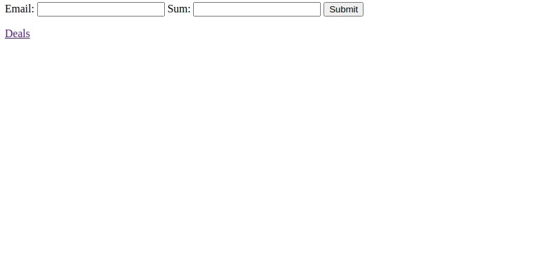

# **Application Form**

### General info
This project has two routes, one of which has a form with two inputs - email and sum.
And the other displays all the deals where the status is 'ask'. When 'send offer' is clicked the corresponding deals status will change to 'offer' in the table.

### Description
Within the project there are two main controllers. The application controller uses its `create` method
to insert information given in the form to the database and calls a private method `deal` which then
determines which partner this application goes to and adds it to the deals table.

The deals controller has an `offer` method which takes the given deal and changes its status from 'ask' to 'offer' and calls 
a function to send an email to the client. The method is called when 'send offer' is clicked on one of the deals in '/deals' route.

At the beggining of this file you can see a simple illustration where two forms are filled out, then the deals page 
is opened. On one of the orders the 'send offer' button is clicked and it disappears because only deals with the 
status 'ask' are shown.
### Setup
Clone this repo to your workspace and run the following commands:
```
composer install
php -S localhost:8000
```
Create a new database. After that you need to open `config.php` and enter the name of the database, your username etc. 
for the project to gain access to it. First time you submit a form two tables will be created - applications and deals.
